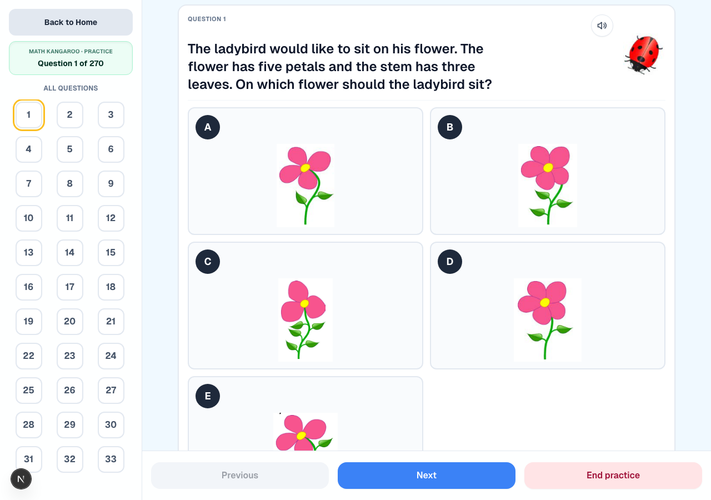
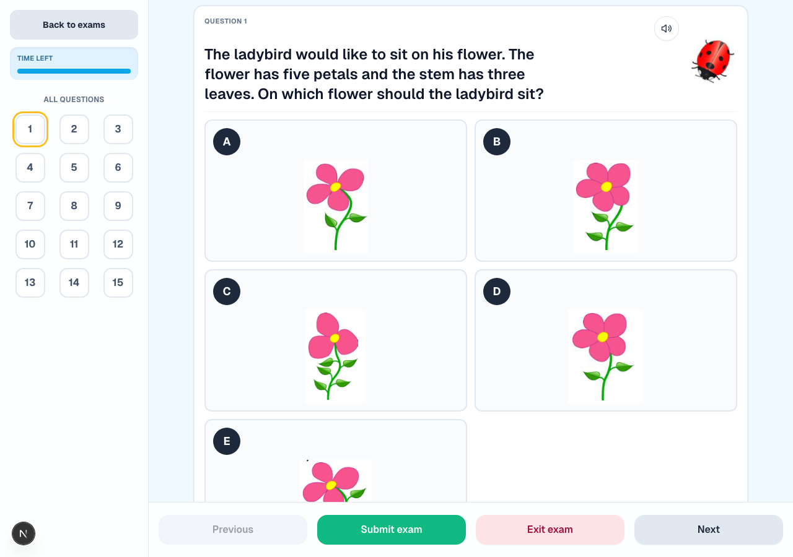

# Math Kangaroo Prep

A full-stack practice platform for Math Kangaroo contest content, with AI-generated explanations, text-to-speech, and a PDF-to-data pipeline. It combines:

- a Next.js web client in `apps/web`
- a FastAPI service in `apps/api`
- a Python PDF/data pipeline in `src/kangaroo_pdf`
- a checked-in `release-data/` dataset consumed by the web and API layers

This is a local/private-beta project. The setup below runs the web app and API; the documentation map links to the data pipeline and deployment notes.



*Practice mode. Most Kangaroo questions are pictures rather than text - stems and answer choices are sent to the model as images, not as a lossy text description. The speaker icon reads the stem aloud.*



*Exam mode, with a countdown across the full question set.*


## Current capabilities

- Exam mode with timed question flow
- Practice mode with per-question feedback
- AI-generated explanations via FastAPI + OpenAI
- Text-to-speech generation for question stems
- `release-data` manifest/exam loading through Next.js route handlers
- PDF extraction, review, and release-data build tooling for content preparation

## Reliability

The product is for 6-7 year olds, so an explanation that states the wrong answer is worse than no explanation at all. The AI path is built around that constraint - see [`apps/api/app/services/explanations.py`](apps/api/app/services/explanations.py).

**Structured output, strictly.** Explanations are generated through the OpenAI Responses API with `strict: true` JSON schema output (`explanation` and `final_answer`, `additionalProperties: false`). The service requests schema-constrained output and validates the returned payload before using it.

**Two answer-label checks.** Each generated attempt must pass both:

1. `final_answer` is normalized and compared against the verified answer key from the release dataset. A mismatch discards the attempt.
2. The explanation *prose* is scanned for answer claims - `answer is X`, `correct answer is X`, `option X is correct`, `X is correct` - and any claim that disagrees with the key discards the attempt.

The second check exists because the first is not enough: a model can fill the `final_answer` field correctly and still argue for a different letter in the body. Validating only the structured field would let that through.

**Bounded retries, then an answer-key fallback.** `MAX_EXPLANATION_ATTEMPTS = 2`. If both attempts fail these checks - bad JSON, empty text, a mismatched answer field, or a detected contradictory claim - the service returns a deterministic message built from the verified key. Both attempts use the same prompt and validation rules. Provider request exceptions occur outside this content-validation loop and do not use its answer-key fallback.

These checks validate answer labels and a small set of English phrases; they do not establish that the mathematical reasoning is correct. Other wording, such as `Choose C`, can pass the prose check even when the key is B. The fallback gives the stored answer with generic guidance; it is not a worked solution.

**A closing answer from the key.** `_finalize_explanation` ensures the response ends with `So the answer is X.` using the verified key. This fixes the closing label, not the reasoning that precedes it.

**Versioned explanation caching.** The explanation cache key is a SHA-256 over sorted JSON of exam ID, question number, selected choice, model, and `PROMPT_VERSION` (currently `grade1_v3`). Bumping the prompt version changes the cache key. The key does not include the question content or answer-key version, so a dataset correction also requires clearing the affected cache or updating the version.

**TTS reuse and bounded cache entries.** `TTSAudioCache` hashes the request inputs and applies a TTL (24h default) and a maximum item count (500 default), pruning oldest-first. A cache hit avoids another speech API call. These settings bound stored entries; they do not cap API spending or prevent new requests from generating more audio.

**Multimodal input.** Many Kangaroo questions are pictures, not text. Question stems and answer choices are sent as `input_image` data URLs alongside the text, so the model reasons over the actual diagram rather than a lossy text description.

## Repository map

```text
.
|-- apps/
|   |-- api/              FastAPI backend for AI explanation and TTS
|   `-- web/              Next.js frontend and server route handlers
|-- docs/                 Project-level technical documentation
|-- release-data/         Frontend/API-ready dataset checked into the repo
|-- scripts/              Operational scripts for local dev and data workflows
|-- src/kangaroo_pdf/     PDF extraction, review, and release build pipeline
`-- tests/                Python test suite for API and data pipeline code
```

## Quick start

### Prerequisites

- Node.js 20+
- npm 10+
- Python 3.12+
- `curl`, `lsof`, and a working shell environment

### 1. Install dependencies

Web dependencies:

```bash
cd apps/web
npm install
cd ../..
```

API dependencies:

```bash
python3 -m pip install -r apps/api/requirements.txt
```

If you plan to work on the PDF/data pipeline, your Python environment also needs the third-party packages imported by `src/kangaroo_pdf`, such as `Pillow`, `PyMuPDF`, `pypdf`, `pdfplumber`, and `python-dotenv`.

### 2. Create `.env`

Copy the example file and fill in at least `OPENAI_API_KEY`:

```bash
cp .env.example .env
```

### 3. Start local development

From the repository root:

```bash
./scripts/dev.sh
```

This starts:

- Next.js at `http://127.0.0.1:3000`
- FastAPI at `http://127.0.0.1:8000`

The script expects a root `.env` file and a valid `OPENAI_API_KEY`.

## Alternative startup paths

### Web only

```bash
cd apps/web
npm run dev -- --hostname 127.0.0.1 --port 3000
```

### API only

```bash
set -a
source .env
set +a
python3 -m uvicorn main:app --app-dir apps/api --host 127.0.0.1 --port 8000
```

### Docker Compose

```bash
docker compose up --build
```

## Verification

### Web

Production build:

```bash
cd apps/web
npm run build
```

### Python

Current recommended test entrypoint:

```bash
python3 -m unittest discover -s tests -v
```

Notes:

- `pytest` is not the repository's current standard entrypoint.
- Some pipeline tests expect external source datasets or generated review inputs that are not checked into this repository.
- `release-data/` is committed, but `original_pdf_data/` is intentionally not part of the repo by default.

## Key runtime interfaces

### Environment variables

- `OPENAI_API_KEY`
- `FASTAPI_BASE_URL`
- `RELEASE_DATA_PATH`
- `API_CACHE_DIR`
- `OPENAI_TTS_MODEL`
- `OPENAI_TTS_VOICE`
- `OPENAI_EXPLANATION_MODEL`
- `TTS_CACHE_TTL_SECONDS`
- `TTS_CACHE_MAX_ITEMS`

### Main routes

Next.js route handlers:

- `/api/exams`
- `/api/exams/[examId]`
- `/api/exams/[examId]/raw/[...path]`
- `/api/practice-bank`
- `/api/ai/explanation`
- `/api/ai/tts`

FastAPI upstream endpoints:

- `/health`
- `/manifest`
- `/exams/{exam_id}`
- `/ai/explanation`
- `/tts`

## Documentation map

- [Architecture](docs/architecture.md)
- [Development](docs/development.md)
- [Deployment](docs/deployment.md)
- [Data pipeline](docs/data-pipeline.md)
- [Release-data format](docs/release-data-format.md)
- [API reference](docs/api.md)
- [Troubleshooting](docs/troubleshooting.md)
- [Contributing](CONTRIBUTING.md)
- [Web app README](apps/web/README.md)

## Known project boundaries

- The repository is optimized for developer collaboration and private/beta use.
- Authentication, rate limiting, and public-production hardening are not fully built into the current stack.
- The committed `release-data/` dataset is the runtime input for the web app, while the full PDF source corpus and some review artifacts live outside the repository by design.

