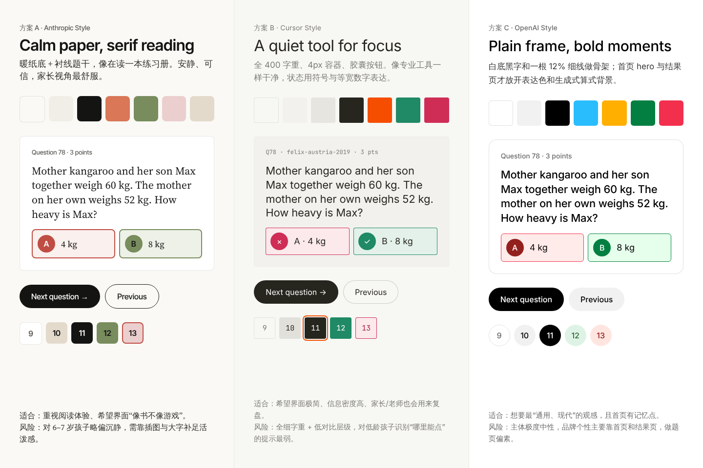

# UI/UX 改版设计方案

三版高保真设计，分别基于三套设计系统：Anthropic Style（A）、Cursor Style（B）、OpenAI Style（C）。三版的页面结构和交互改动相同，只有视觉语言不同，方便直接比选。



## 文件

| 路径 | 内容 |
|---|---|
| [`plan-a.md`](plan-a.md) | 方案 A 说明：理念、token、组件差异 |
| [`plan-b.md`](plan-b.md) | 方案 B 说明：理念、token、组件差异 |
| [`plan-c.md`](plan-c.md) | **方案 C 完整实施规格**：token、组件、页面、交互改动、改动文件、验收标准 |
| `tokens/*-style.tokens.json` | 三套设计系统的原始 token（2026‑10 拷贝） |
| `tokens/plan-c.tokens.css` | 方案 C 落地用的 CSS 变量 |
| `prototypes/` | 25 个画板的原型源码（`.dc.html`）和题图 |
| `screenshots/` | 每个画板的截图 |

## 每套方案的 8 个画面

| # | 画面 | A | B | C |
|---|---|---|---|---|
| 1 | 首页 | [A](screenshots/anthropic-1-home.png) | [B](screenshots/cursor-1-home.png) | [C](screenshots/openai-1-home.png) |
| 2 | 选卷 | [A](screenshots/anthropic-2-exam-picker.png) | [B](screenshots/cursor-2-exam-picker.png) | [C](screenshots/openai-2-exam-picker.png) |
| 3 | 考试进行中 | [A](screenshots/anthropic-3-exam-run.png) | [B](screenshots/cursor-3-exam-run.png) | [C](screenshots/openai-3-exam-run.png) |
| 4 | 交卷后 / 结果 | [A](screenshots/anthropic-4-exam-result.png) | [B](screenshots/cursor-4-exam-result.png) | [C](screenshots/openai-4-exam-result.png) |
| 5 | 练习 + 讲解 + 变式题 | [A](screenshots/anthropic-5-practice.png) | [B](screenshots/cursor-5-practice.png) | [C](screenshots/openai-5-practice.png) |
| 6 | 结束练习对话框 | [A](screenshots/anthropic-6-practice-exit.png) | [B](screenshots/cursor-6-practice-exit.png) | [C](screenshots/openai-6-practice-exit.png) |
| 7 | 手机练习（390×844） | [A](screenshots/anthropic-7-mobile.png) | [B](screenshots/cursor-7-mobile.png) | [C](screenshots/openai-7-mobile.png) |
| 8 | 组件与状态总表 | [A](screenshots/anthropic-8-components.png) | [B](screenshots/cursor-8-components.png) | [C](screenshots/openai-8-components.png) |

第 8 张汇总了：按钮各状态、题号 7 种状态、选项 6 种状态、朗读按钮 4 种状态、计时器（正常 / 剩不到 5 分钟）、讲解面板（收起 / 加载 / 失败 / 已保存）、展开的变式题、交卷与离开考试确认框，以及加载中 / 无试卷 / 加载失败 / 题号不存在四种页面状态。

## 三版共同的交互改动

1. 交卷、离开考试、结束练习都改为自绘对话框，不再用 `window.confirm`。
2. 计时器始终显示剩余时间，剩不到 5 分钟时变警示色。
3. “交卷”和“退出”从底部按钮栏移开，底栏只保留上一题 / 下一题，减少孩子误触。
4. 选卷页按系列 + 年份展示，取代 “2023‑1 / 2023‑2”，并可按系列筛选。
5. 交卷后显示得分构成，可以“跳到下一道错题”。
6. 练习页加“跳到第 N 题”，侧栏有状态图例。
7. 所有可点区域 ≥ 44–48px。

细节见 `plan-c.md` §6。

## 本地预览原型

`.dc.html` 原本在 Claude Design 画布里编辑。`prototypes/support.js` 是一个最小的预览运行时，可以在浏览器里静态渲染这些文件（不含交互）：

```bash
cd docs/design/prototypes
python3 -m http.server 8000
# 打开 http://localhost:8000/Main.dc.html 或 http://localhost:8000/openai/Practice.dc.html
```

需要能访问 Google Fonts，否则会回退到系统字体。

## 说明

- 题图是 `generated/` 下的变式题 SVG。原题图片不在仓库里，所以“袋鼠体重”一题的配图借自它的变式题，只作占位。
- 画面里的数据（79/120、第 78 题、15 对 4 错 5 跳过）都是按真实题目、答案和计分规则算出来的演示状态。
- 设计系统是风格参考，与 Anthropic、Cursor（Anysphere）、OpenAI 均无关联；原型只使用开源字体（Inter、Inter Tight、Source Serif 4、JetBrains Mono）。
